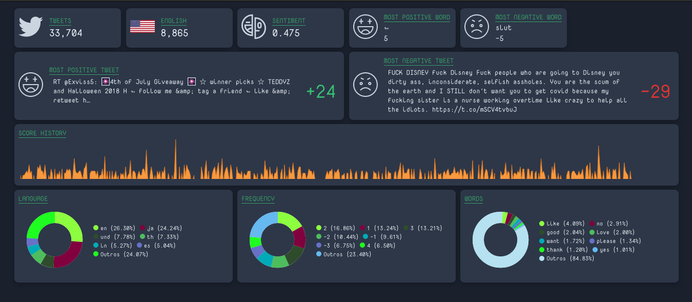

# `twitter-sentiment-dashboard`

This is a simple real-time dashboard to see what people are saying on Twitter and check out if they're having positive or negative thoughts.




## Overview

Imagine if one can simply open a tool to see the current mood of Twitter in general, you don't have to read tons of tweets you only need to open this tool and wait for it to read all this, a few seconds later you can see everybody just mad about something that the president said or a bunch of people spreading their love only because they can.

Instant feedback of what's the current mood of Twitter users is the main goal here.

## How it's done?

All this starts with twitter providing us an API with a stream to subscribe, you can see [details here](https://developer.twitter.com/en/docs/labs/sampled-stream/api-reference/get-tweets-stream-sample), with that in mind we built a web socket to receive all sample data an get it delivered to the clients, after that the client shows all the insights about everything he's receiving.

To extract the sentiment of a piece of text the [AFINN-165](https://github.com/words/afinn-165) is used together with the library [sentiment](https://github.com/thisandagain/sentiment), basically what they do is rate every word in a sentence in a score that goes from -5 to 5.

### Caveats

- Twitter only gives us 1% of all the data they get.
- Only English tweets are analyzed.

## Features

Follows all the real-time pieces of information:

- Amount of tweets read
- Amount of English tweets (only they are analyzed)
- Average of sentiment score for all tweet in English
- The most positive word
- The most negative word
- The most positive tweet
- The most negative tweet
- Last 500 score history in a line chart
- Languages distribution in a pie chart
- Frequency of scores in a pie chart
- Most to less common words in a pie chart

## Deploy and usage

After cloning the repository, here follow the steps to get it up and running

### Get Twitter credentials

Get a Twitter `consumer_key` and `consumet_api`, you going to need to create an account and answer a bunch of questions.

### Start the web socket server

To start it, you going to need four environment variables:

- `PORT`: a port to the server
- `CONSUMER_KEY`: Twitter's API consumer key
- `CONSUMER_SECRET`: Twitter's API secret key
- `ALLOW_ORIGINS`: All the allowed client's URL (comma separated)

After setting this up you only need to run:

```sh
cd ws/
node index.js
```

### Start the web application

The frontend application is going to use port 3000.

```sh
cd app/
npm start
```

After that, a new tab or window in your browser should be opened and the analyzer should be up and running.
